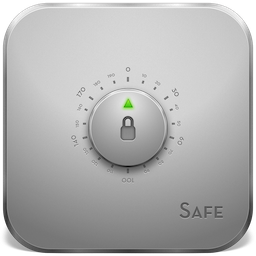
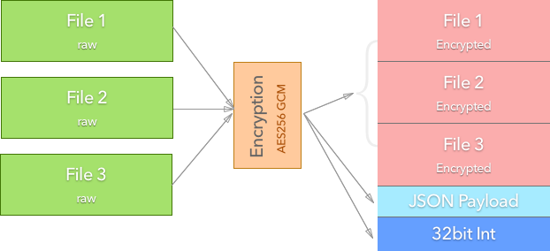

# Safe [](https://www.npmjs.com/package/safe-encrypt) [](https://www.npmjs.com/package/safe-encrypt)

Ever needed to secure your files in a fast and simple way ? Then look no further because Safe is the ultimate encryption app that you'll ever need.
Safe features industry strength AES256 GCM encryption while being very easy to use and very fast, which makes it perfect for daily use. You can now secure your files, e-mail attachments or messages with ease without having to worry about prying eyes.

<p align="center"></p>


## Installation

```bash
$ npm install safe-encrypt -g
```

## Usage

### Encryption

> encrypt a single file

```bash
$ safe encrypt 'password' /home/downloads/secret.pdf /home/downloads/secret.safe
```

> encrypt a folder and all files inside a folder recursively

```bash
$ safe encrypt 'password' /home/downloads/secret-folder /home/downloads/mydocs.safe
```

### Decryption

> decrypt

```bash
$ safe decrypt 'password' /home/downloads/secret.safe /home/downloads
```

### List contents

> list encrypted files and show encryption info

```bash
$ safe list 'password' /home/downloads/secret.safe
```

## Functionality

### Chart

<p align="center"></p>

### JSON Payload

The JSON payload consists of an object containing all the encryption information: file names, relative paths, sizes, SHA1 hashes, encrypted chunks info, encryption date

```javascript
{
	"files": [
		{
			"path": "/relative/file/path",
			"hash": "SHA1 file hash",
			"size": 0,
			"chunks": [
				{
					"size": 0,
					"authTag": "Auth tag in hexadecimal",
					"iv": "IV in hexadecimal"
				}
				...
			]
		}
		...
	],
	"totalSize": 0,
	"date": "Thu Feb 02 2017 00:00:00 GMT+0100 (CET)"
}
```

### 32bit Integer

This represents the size of the encrypted payload. In order to read the correct amount of data for the payload we need to know the exact size of the encrypted payload data.

## Todo

* check if the relative decryption destionation path not exists already. we don't want to overwrite already existing files